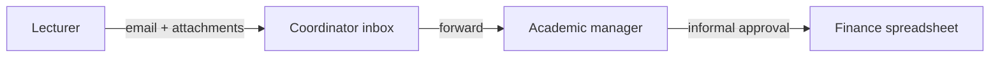
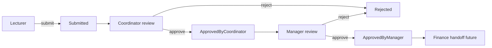

# CMCS — Process: As-Is vs To-Be

## As-is (email and paper)

Lecturers email timesheets and attachments. Coordinators and managers approve via reply chains. Finance totals are rebuilt manually.

| Pain point | Effect |
|------------|--------|
| No shared queue | Claims buried in personal inboxes |
| Scattered files | Wrong version of evidence |
| Email-only approval | Weak audit proof |
| Manual reporting | Slow month-end close |

---

## To-be (CMCS web workflow)

One application, role-based dashboards, explicit statuses, documents stored on the claim, every transition logged in `ClaimStatusHistory`.

---

## Side-by-side

| Topic | As-is | To-be |
|-------|-------|-------|
| Submission | Email | Web form + upload |
| Work queue | Inbox search | Dashboard filtered by status |
| Approval evidence | Email thread | History row + user + timestamp |
| Rejection feedback | Reply email | Notes on claim detail |
| Access | Informal | ASP.NET Identity roles |

## Status codes

| StatusID | Name | Meaning |
|----------|------|---------|
| 1 | Submitted | Lecturer submitted |
| 2 | ApprovedByCoordinator | Ready for manager |
| 3 | ApprovedByManager | Ready for payment |
| 4 | Rejected | Returned with notes |
| 5 | Paid | Future finance step |

## Change impact (summary)

| Group | What changes |
|-------|----------------|
| Lecturers | Login, single claim form, track status online |
| Coordinators | Dashboard queue instead of inbox triage |
| Managers | Second queue + export for finance |
| IT | Standard ASP.NET Core + SQL hosting |
