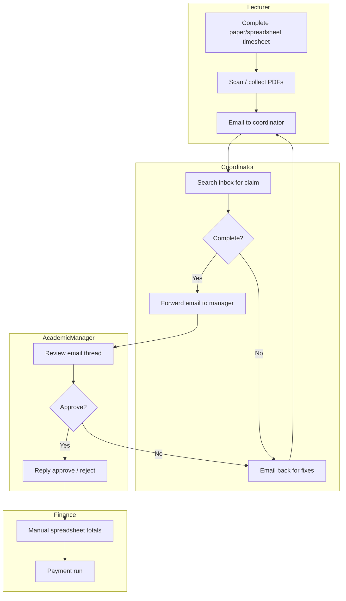
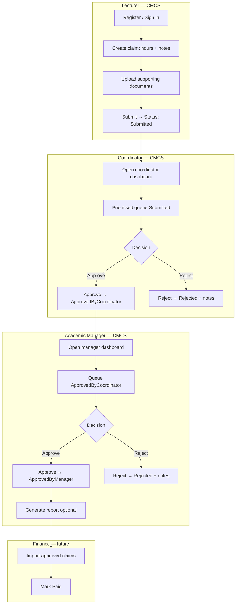

# CMCS — Process: As-Is vs To-Be

## As-is process (paper and email)

Lecturers complete a paper or spreadsheet timesheet, scan supporting evidence, and email the package to a programme coordinator. The coordinator forwards approved packs to an academic manager via email. Finance receives ad-hoc summaries. Status is inferred from reply chains; attachments are duplicated across inboxes.

### As-is pain points

- No single queue; coordinators triage personal inboxes.
- Version control on attachments is poor.
- Approval authority is implicit in email text, not structured data.
- Reporting requires manual copy/paste.

---

## To-be process (CMCS)

All actors use the web application. Identity roles control access. Status transitions are explicit and logged. Documents live with the claim record.

---

## Process comparison

| Dimension | As-is | To-be (CMCS) |
|-----------|-------|--------------|
| Submission channel | Email | Web form |
| Evidence storage | Mail attachments | Linked `SupportingDocument` rows + file store |
| Work queues | Inbox search | Role dashboards filtered by status |
| Approval evidence | Email headers | `ClaimStatusHistory` with user id and timestamp |
| Rejection feedback | Reply email | History notes visible on claim detail |
| Reporting | Manual | Manager report endpoint (text export) |
| Access control | Informal | ASP.NET Identity roles |

## Status alignment

| Step | Business status | StatusID |
|------|-----------------|----------|
| Lecturer submits | Submitted | 1 |
| Coordinator approves | ApprovedByCoordinator | 2 |
| Manager approves | ApprovedByManager | 3 |
| Either rejects | Rejected | 4 |
| Finance completes (future) | Paid | 5 |

## Change impact

| Group | Change | Mitigation |
|-------|--------|------------|
| Lecturers | New login and form | Short guide; hourly rate on registration |
| Coordinators | Dashboard instead of inbox | Training on prioritisation scores |
| Managers | Second queue in system | Report export for finance handoff |
| IT | Host SQL + web app | Standard ASP.NET Core deployment |
