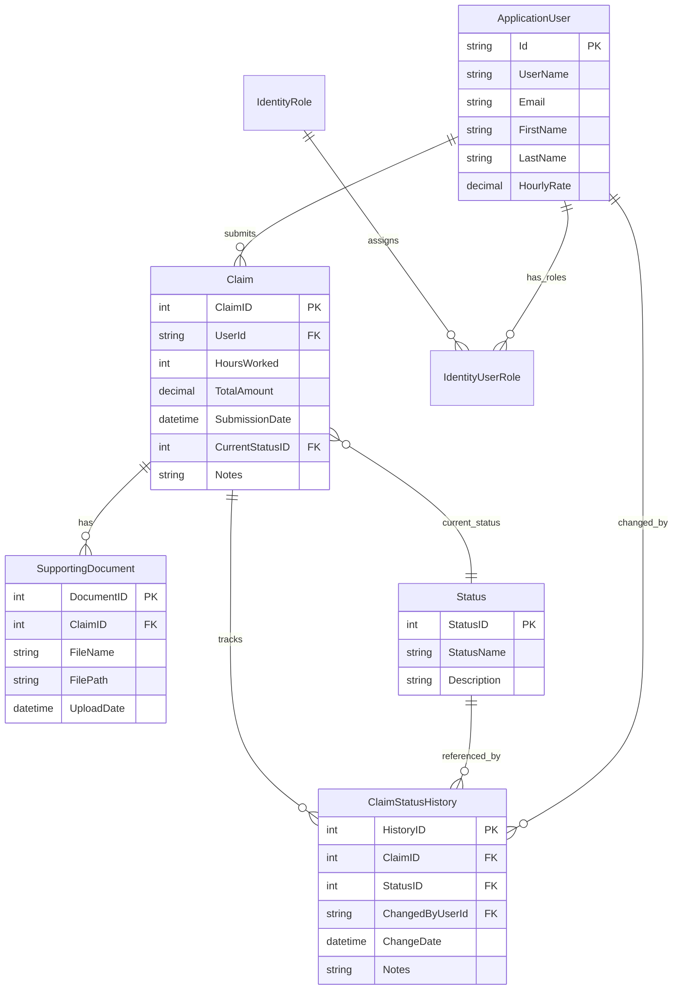

# CMCS — Data Model

## Overview

CMCS extends **ASP.NET Core Identity** with domain entities for claims, documents, statuses, and audit history. The lecturer (`ApplicationUser`) owns many claims; each claim has one current status and optional many supporting documents and history rows.

## Entity relationship diagram

## Entity definitions

### ApplicationUser (extends IdentityUser)

| Attribute | Type | Rules |
|-----------|------|-------|
| FirstName, LastName | string(100) | Required |
| HourlyRate | decimal(18,2) | Required; used at claim submission |
| Claims | collection | One-to-many |

### Claim

| Attribute | Type | Rules |
|-----------|------|-------|
| HoursWorked | int | Range 1–200 |
| TotalAmount | decimal(18,2) | Calculated on submit |
| SubmissionDate | datetime | Default now |
| CurrentStatusID | int | FK to Status |
| Notes | string(500) | Optional |

### SupportingDocument

| Attribute | Type | Rules |
|-----------|------|-------|
| FileName | string | Original name |
| FilePath | string | Relative path under wwwroot |
| UploadDate | datetime | Set on upload |

### Status (reference data)

| StatusID | StatusName | Description |
|----------|------------|-------------|
| 1 | Submitted | Claim submitted by lecturer |
| 2 | ApprovedByCoordinator | Approved by programme coordinator |
| 3 | ApprovedByManager | Approved by academic manager |
| 4 | Rejected | Claim rejected |
| 5 | Paid | Claim has been paid (future use) |

### ClaimStatusHistory

Append-only audit of transitions. Each row captures **StatusID**, **ChangedByUserId**, **ChangeDate**, and optional **Notes**.

## Relationships and delete behaviour

- `Claim.UserId` → `ApplicationUser`: **Restrict** on delete (protect historical claims).
- `Claim.CurrentStatusID` → `Status`: **Restrict**.
- `ClaimStatusHistory.ChangedByUserId` → `ApplicationUser`: **Restrict**.

## Physical storage

| Store | Location |
|-------|----------|
| Relational data | SQL Server / LocalDB — database `CMCS_Database` |
| Uploaded files | `wwwroot/uploads/claim_{ClaimID}/` (unique GUID prefix per file) |

## Identity roles (logical)

Roles are not separate business tables; they use Identity `AspNetRoles`:

| Role name | Maps to stakeholder |
|-----------|---------------------|
| Lecturer | Independent contractor lecturer |
| Coordinator | Programme coordinator |
| Manager | Academic manager |
| HR | Extension / demo seed only |

## Data volume assumptions (pilot)

| Entity | Estimated rows / month |
|--------|------------------------|
| Claims | 50–200 |
| SupportingDocument | 1–3 per claim |
| ClaimStatusHistory | 2–4 per claim |

## Implementation reference

- DbContext: `Data/ApplicationDbContext.cs`
- Models: `Models/Claim.cs`, `SupportingDocument.cs`, `Status.cs`, `ClaimStatusHistory.cs`, `ApplicationUser.cs`
