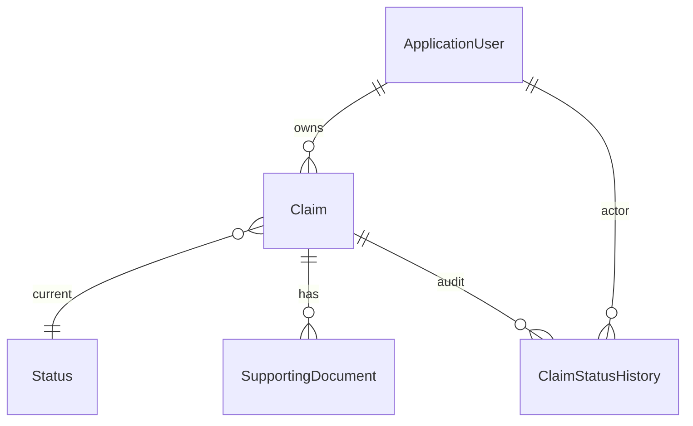

# CMCS — Data Model

## Concept

Identity handles users and roles. Business data centres on **Claim**, with **SupportingDocument** evidence and **ClaimStatusHistory** for audit.

## Core entities

### ApplicationUser (extends IdentityUser)

| Field | Purpose |
|-------|---------|
| FirstName, LastName | Display name |
| HourlyRate | Used when calculating claim total |

### Claim

| Field | Rules |
|-------|-------|
| HoursWorked | 1–200 |
| TotalAmount | Hours × hourly rate at submit |
| CurrentStatusID | FK → Status |
| Notes | Optional, max 500 chars |

### SupportingDocument

File metadata linked to a claim; binary stored under `wwwroot/uploads/claim_{ClaimID}/`.

### Status (reference)

| ID | Name |
|----|------|
| 1 | Submitted |
| 2 | ApprovedByCoordinator |
| 3 | ApprovedByManager |
| 4 | Rejected |
| 5 | Paid (future) |

### ClaimStatusHistory

Append-only: status, actor user id, timestamp, optional notes.

## Roles (Identity)

| Role | Stakeholder |
|------|-------------|
| Lecturer | Submits claims |
| Coordinator | Reviews Submitted |
| Manager | Reviews ApprovedByCoordinator |
| HR | Demo extension (payments UI) |

## Delete behaviour

Claims and history use **Restrict** on user delete so financial records are preserved.

## Code references

- `Data/ApplicationDbContext.cs`
- `Models/Claim.cs`, `SupportingDocument.cs`, `Status.cs`, `ClaimStatusHistory.cs`, `ApplicationUser.cs`
