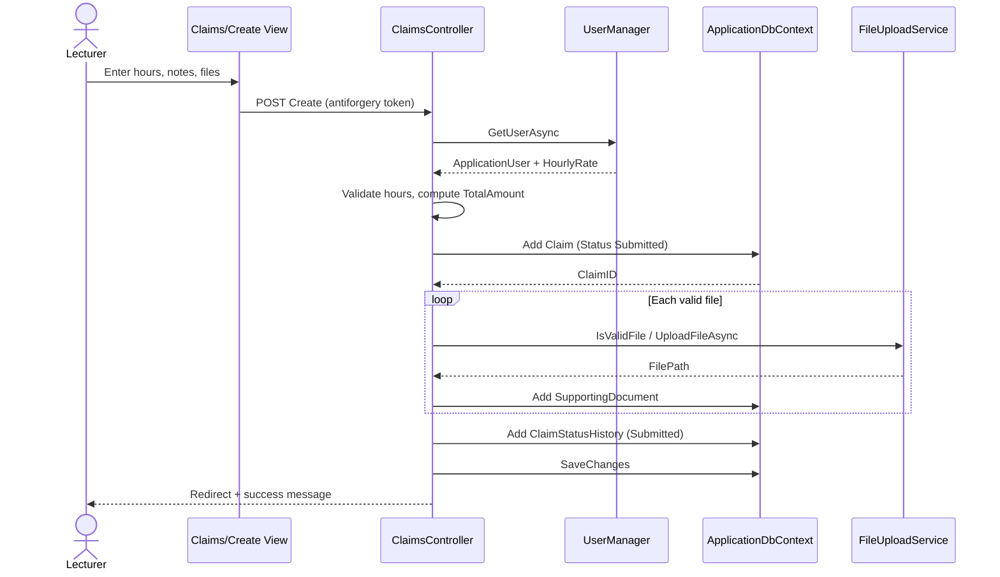
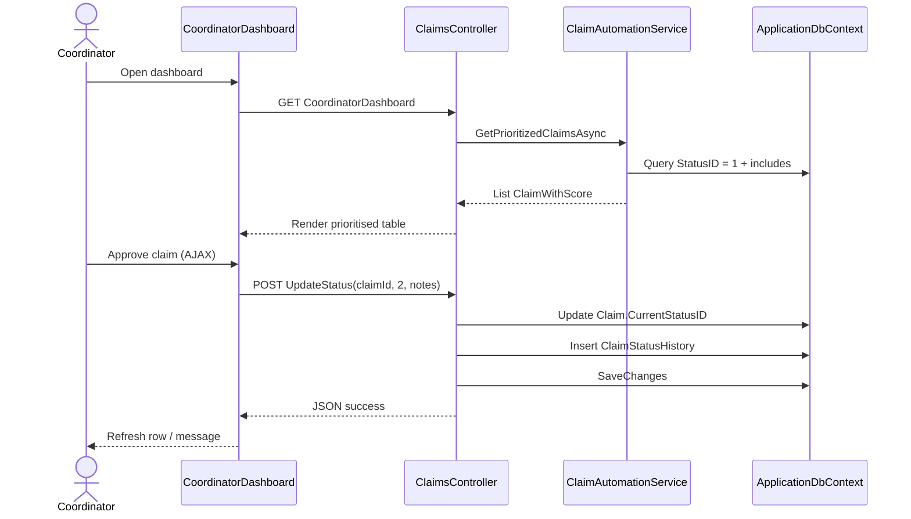
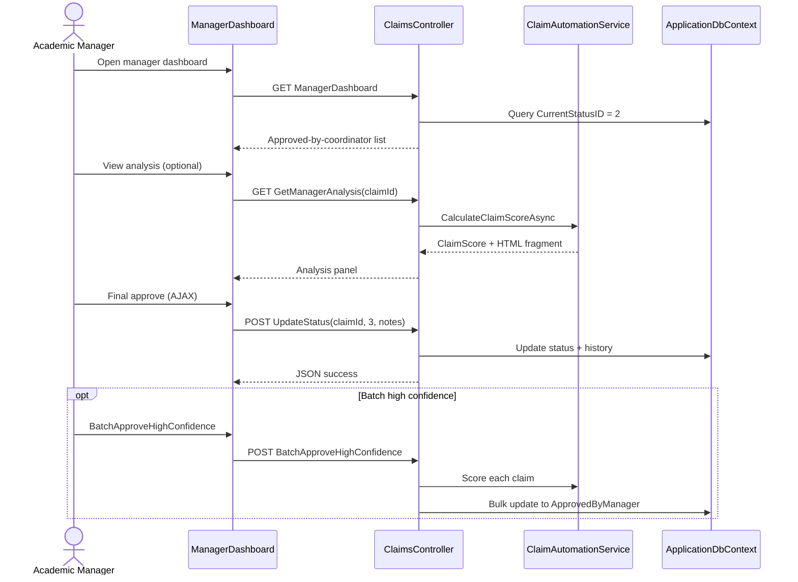
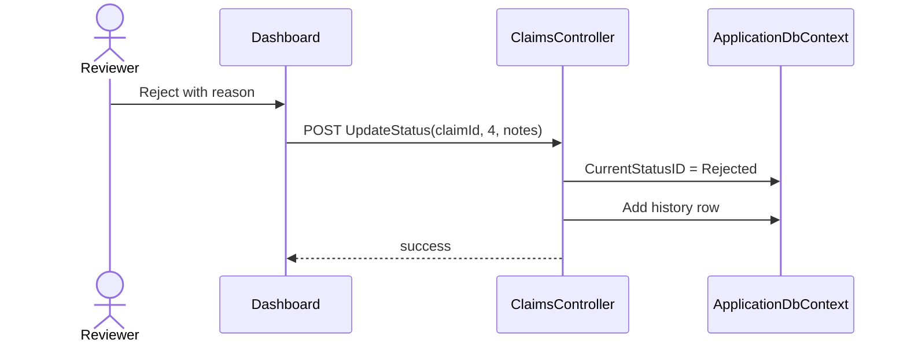

# CMCS — Sequence Flows

## Flow 1 — Lecturer submits claim

End-to-end path from form submission through persistence and initial history.

---

## Flow 2 — Coordinator reviews and approves

Coordinator dashboard loads prioritised **Submitted** claims; approval updates status via AJAX.

**Optional path:** Coordinator invokes **AutoApproveClaim**; controller calls `ProcessAutomatedApprovalAsync` and only advances status when automation rules pass.

---

## Flow 3 — Manager final approval

Manager works on claims already in **ApprovedByCoordinator** status.

---

## Flow 4 — Rejection (coordinator or manager)

Same `UpdateStatus` endpoint with `newStatusId = 4` (Rejected). Notes should capture reason for lecturer visibility on **Details**.

---

## Authorization checkpoints

| Step | Required role |
|------|----------------|
| Create claim | Lecturer |
| CoordinatorDashboard | Coordinator |
| ManagerDashboard | Manager |
| UpdateStatus | Coordinator or Manager |
| BatchApproveHighConfidence | Manager |

---

## Error handling notes

- If automation fails on coordinator dashboard load, controller falls back to a plain pending list (NFR-09).
- Invalid files are skipped during upload loop; lecturer may receive success with partial attachments unless all files invalid.

See [09-acceptance-tests.md](./09-acceptance-tests.md) for executable test mapping.
