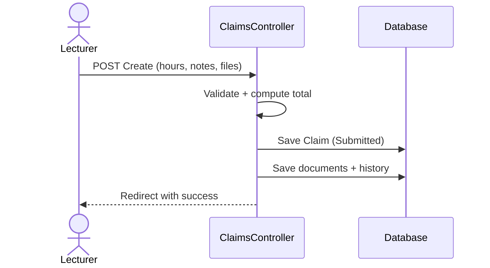
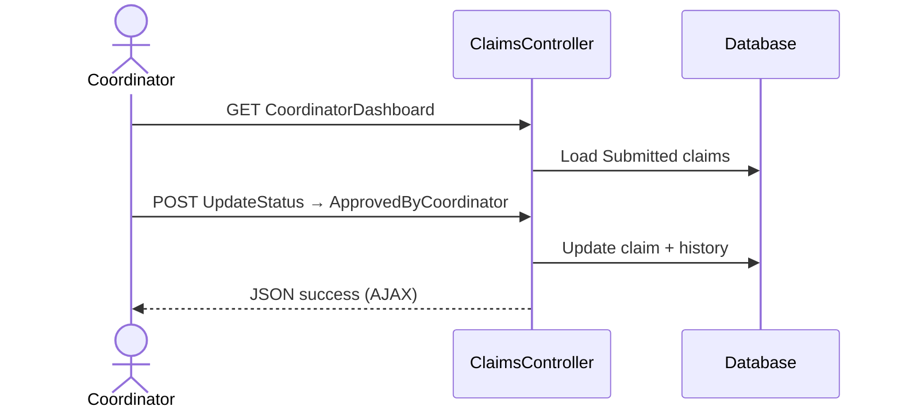
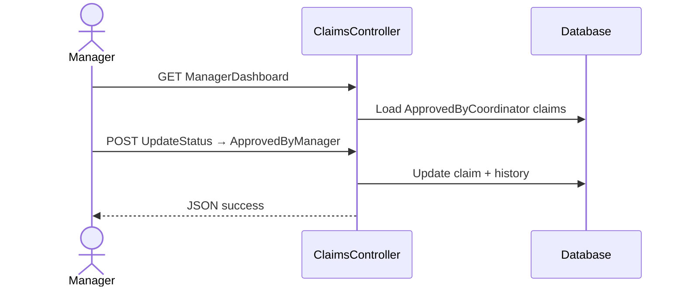

# CMCS — Sequence Flows

Three flows cover the happy path and rejection. All POST actions use antiforgery tokens; status changes go through `ClaimsController.UpdateStatus` unless noted.

## 1 — Lecturer submits a claim

## 2 — Coordinator approves

Optional: **AutoApproveClaim** runs automation rules before advancing status.

## 3 — Manager final approval

Batch **BatchApproveHighConfidence** may approve multiple high-scoring claims in one request.

## Rejection (coordinator or manager)

Same endpoint with status **Rejected (4)** and notes stored on history for the lecturer to read on **Details**.

## Who can do what

| Action | Role |
|--------|------|
| Create claim | Lecturer |
| Coordinator dashboard | Coordinator |
| Manager dashboard | Manager |
| UpdateStatus | Coordinator or Manager |

## Resilience

If automation fails when loading the coordinator dashboard, the controller falls back to a plain pending list (see NFR-09 in requirements).

Test mapping: [08-traceability-matrix.md](./08-traceability-matrix.md).
