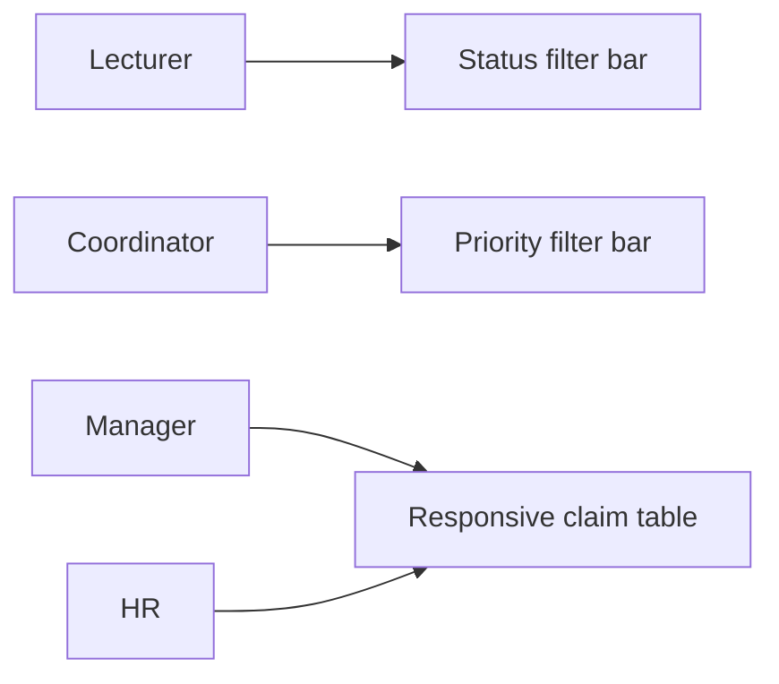

# CMCS — UI/UX capabilities (implementation)

Frontend polish lives in `Views/` and `wwwroot/` without changing Identity or claim workflow rules.

## Shared components

| Component | Location | Purpose |
|-----------|----------|---------|
| Status badge | `Views/Shared/_ClaimStatusBadge.cshtml` | Consistent labels and colours for all claim statuses |
| Flash messages | `Views/Shared/_FlashMessages.cshtml` | Success, error, and info alerts from `TempData` / `ViewBag` |
| Empty state | `Views/Shared/_EmptyState.cshtml` | Friendly zero-data panels with optional call-to-action |

Flash alerts use `data-cmcs-autodismiss="true"` for non-blocking success/info toasts (6s) via `wwwroot/js/site.js`.

## Role dashboards

| Role | UX feature |
|------|------------|
| Lecturer | Quick stats (in progress, paid to date); client-side status filters on claim list |
| Coordinator | Priority filter on queue; empty queue state |
| Manager | Sticky/responsive tables; empty approval state |
| HR | `cmcs-table` styling; empty payment queue state |

## Styling tokens

Design tokens and table helpers are in `wwwroot/css/site.css`:

- `.cmcs-filter-bar` — pill-style filter buttons
- `.cmcs-table-scroll` — mobile scroll hint
- `.cmcs-table-sticky` — sticky header on wider viewports

## Traceability

| UX capability | Related requirements |
|---------------|---------------------|
| Responsive Bootstrap dashboards | NFR-07 |
| Consistent status display | FR-19, NFR-13 |
| Lecturer claim history filters | FR-19 (usability extension) |
